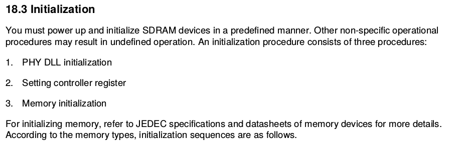
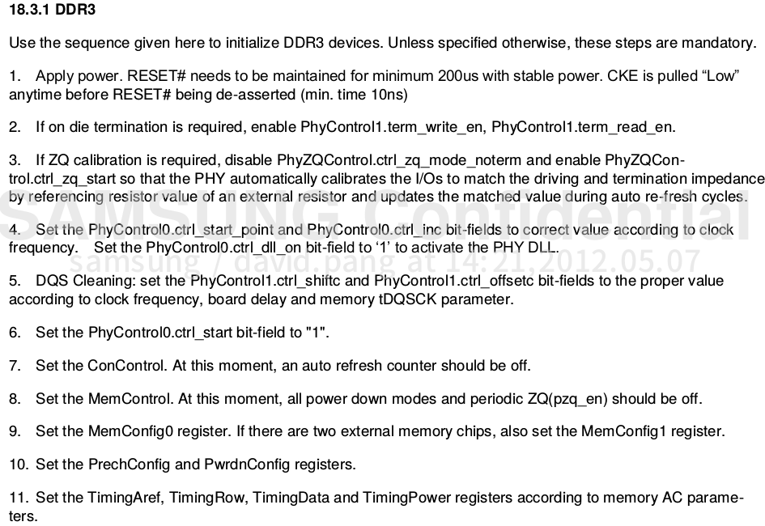
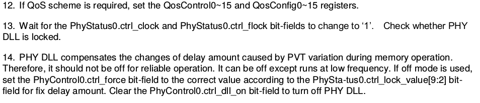
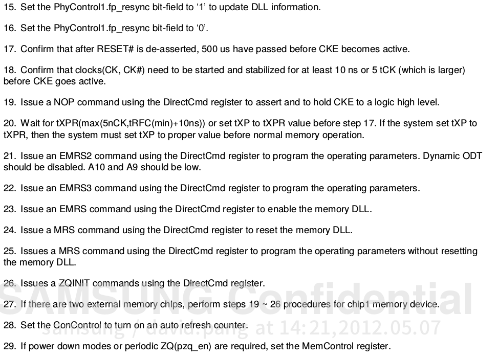

# sdram程序说明

* 修改自: <http://blog.csdn.net/eshing/article/details/37116637>

* clock_init_tiny4412.S
    ```C
        /*
        * system_clock_init: Initialize core clock and bus clock.
        * void system_clock_init(void)
        */

            .globl system_clock_init
        system_clock_init:
    ```
* mem_init_tiny4412.S
    ```C
            .globl mem_ctrl_asm_init
        mem_ctrl_asm_init:

        /*
        * uart_asm_init: Initialize UART in asm mode, 115200bps fixed.
        * void uart_asm_init(void)
        */
            .globl uart_asm_init
        uart_asm_init:

                .globl uart_asm_putc
        uart_asm_putc:

            .globl uart_asm_putx
        uart_asm_putx:
    ```

* mmc_relocate.c
    ```C
        void copy_code_to_dram(void);
    ```

* 调用过程
  * 1、 BOOT/start.S
    * 第一步 调用system_clock_init函数初始化时钟，函数的实现位于clock_init_tiny4412.S，这个文件是从U-BOOT中Copy过来进行了适当修改得到的。
    * 第二步 调用mem_ctrl_asm_init函数初始化内存，函数的实现位于mem_init_tiny4412.S，这个文件是从U-BOOT中Copy过来进行了适当修改得到的。
    * 第三步 调用uart_asm_init函数初始化串口0，函数的实现位于mem_init_tiny4412.S，这个文件是从U-BOOT中Copy过来的。我copy了这个函数是为了在调试时使用的，说实话，这个程序有时是不能正常运行历功了，我现在也没有找到原因所在，我现在主要觉得内存初始化有问题，以及下一步的拷贝函数有问题。
    * 第四步 调用copy_code_to_dram将user.bin从SD 卡拷贝到DRAM 的0x43E00000 处，copy_code_to_dram的实现位于文件mmc_relocate.c；
  * BOOT/clock_init_tiny4412.S
    * clock_init_tiny4412.S是从从U-BOOT中Copy过来的，我进行了一点点修改，我之所以把这个文件也Copy过来是因为我觉得我将要Copy的mem_init_tiny4412.S中mem_ctrl_asm_init初始化函数，与时钟相关的寄存器设置是建立在U-BOOT的时钟基础上，如果不要clock_init_tiny4412.S文件，DRAM可能初始化不成功。
    * 关于这个文件的解释，大家可以参考我随后的U-BOOT的移植说明文档。这里由于设置的寄存器过多且繁杂，不做过多说明。  * BOOT/mem_init_tiny4412.S

    * Exynos4412已经告诉我们如何初始化DDR3类型的DRAM，主要分为初始化PHY DLL、初始化控制寄存器，和初始化DRAM 三大步骤，具体细分共21个小步骤，相当繁琐，由于涉及到的寄存器过多，如果一一介绍将需要非常大的篇幅，所有这个文档并不会一一解释寄存器的设置，DRAM的简要初始化步骤见下图，此图是Copy于芯片手册。
      * 
      * 
      * 
      * 